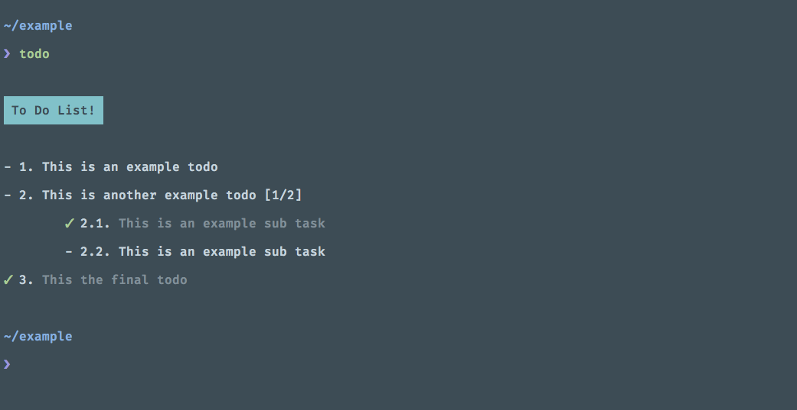

# To Do Command Line App [Not Ready Yet]

A quick way of noting down your to do's on your current project.



## Wait, is this a normal todo list?
Pretty much. Only difference is its completely on the command line. 

## How does it work?
Simply running ```todo init``` will create a todo.json file in your current working directory. You can then use the app to create new todo tasks like so:
```bash
todo 'This is my new task'
```

### You can add multiple tasks at once
Just simply add 'and' after each todo  
```bash
todo 'This' and 'That' and 'This'
```

You can even create sub tasks.  
```bash
todo 'This is a subtask' -s 2
```

### Viewing your todo list
Just type:
```bash
todo
```

You can also view a task by its index
```bash
todo 1
```

### How do I mark a task down as completed
```bash
todo done 1
todo done 1.2
todo -d 1.2
```

### Editing a task
```bash
todo edit 1 'This is an edit to the task'
```

### Deleting a task
Use either one of the following commands
```bash
todo remove 1
todo delete 1
todo -r 1
todo rm 1
```

Your can delete all your todos with the following command 
```bash
todo --delete-all
```
**Note:** You will need to confirm your would like to wipe your todo list

## Installation
via composer:
```bash
composer global require kakposoe/todos
```

manual installation
```bash
git clone http://github.com/kakposoe/todos 
```

You would then called todo using:
```bash
./todo 'This is an example task'
```

___

## Version 1 (Things to work on for stable release)
- Check if indexes are numeric
- Check functions to see if 'check if' exists ??
- Add 'No More tasks' if all task have been completed within group of tasks
- Chain removal of events e.g. <code>todo remove 2 and 3 and 4 and 5</code>
- Chain completion of events e.g. <code>todo done 2 and 3 and 4 and 5</code>
- Check if index exists when editing a task

## Version 2
- Method to convert sublevel tasks to top level tasks
- Complete tasks using menu select
- Deadline keys and visual representation of tasks past their deadline
- Add High Priority Indicator
- List all tasks that are incomplete
- Multilevel child tasks
- Group tasks into subtasks with new parent
- Move tasks to be subtask of current parent
